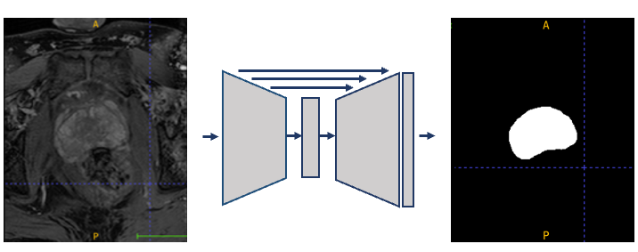

**Additional Project Description**

An alternative approach for automatic segmentation, which does not require registration, is via pixel-based classification. Here the delineated patient images form the training set, where each pixel is a sample, labeled as foreground (organ of interest) or background. The training set is used to train a classifier, with a common approach being to use a deep learning model such as a U-Net, demonstrated in Figure 1.

*Figure 1: a schematic of a U-Net model, taking the prostate MR image as input and outputting the binary segmentation mask.*

However, for training, it is important to have a large training set, and in practice this may not always be available. A large dataset is not available in this case. A recent idea to tackle this problem is to train deep generative models to generate synthetic training data. These synthetic images can then be used along with the real images in order to train the segmentation model.

**Task**

Train a generative model to create synthetic images and investigate the use of these images to improve the training of the segmentation model.

**Practical Aspects**

* The practical session will introduce a segmentation model based on the U-Net and a baseline VAE implementation.
* First implement the segmentation model, starting from train_seg.py. The outline of the code is given and parts you should implement are indicated with `# TODO`
* Then move onto the VAE.
* For your project, you are free to build on top of this or to use a different approach. Remember the discussion from the lecture on the limitations of VAEs and potential solutions to this.
* The images should be processed in 2D, segmenting each slice one-by-one, rather than in 3D, and they are downsampled by the dataloader to save computation time.
* It is recommended to spend time optimising the generative model rather than the segmentation model as that is the the main focus of this part of the course.
* Remember that this project is more similar to a research project than a course assignment and as such, good results are not guaranteed. You will still score highly for a good approach irrespective of the results.
* It is recommended to set up a new virtual environment in the directory you are writing the code using: `python3 -m venv venv`. Remember to activate the environment (how exactly depends on your system) and install the dependencies using the requirements.txt file: `pip install -r requirements.txt`.

